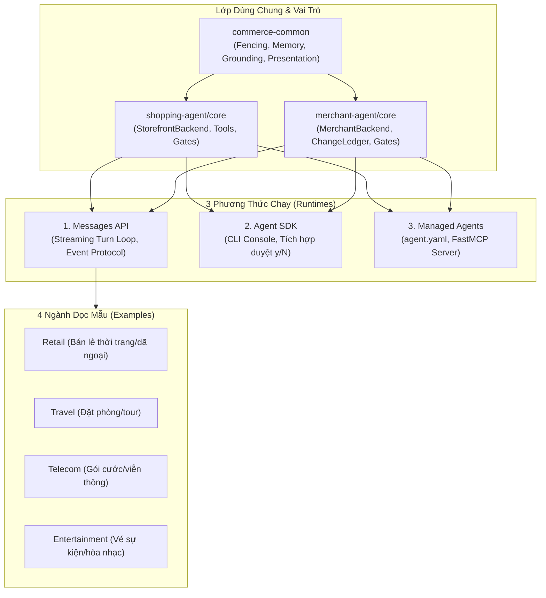

# Hướng Dẫn Sử Dụng Dự Án Claude Commerce Agents

> **Tài liệu tham khảo chính thức** cho việc xây dựng và vận hành các Agent thương mại điện tử (Commerce Agents) sử dụng Claude: bao gồm **Shopping Agent** (B2C) và **Merchant Agent** (B2B), hỗ trợ 3 cơ chế runtime, 4 ngành dọc mẫu (verticals), cùng bộ công cụ Claude Code plugin.

---

## 1. Tổng Quan Kiến Trúc (Architecture Overview)

Dự án cung cấp 2 vai trò Agent thương mại chính, được định nghĩa thống nhất (Prompt, Skills, Tool contracts, Gates) và có thể triển khai trên 3 môi trường thực thi (runtimes):



### 1.1 Hai Vai Trò Agent (Two Agent Roles)
1. **Shopping Agent (Khách hàng B2C):**
   - Hỗ trợ khách hàng tìm kiếm sản phẩm, so sánh tính năng, lập kế hoạch ngân sách, quản lý giỏ hàng, tra cứu chính sách và trạng thái đơn hàng.
   - Có khả năng ghi nhớ sở thích cá nhân hoá của khách hàng (`memory extraction`).
   - 5 kỹ năng chính (`skills/`): `search-discovery`, `purchase-research`, `planning-goals`, `customer-care`, `memory-personalization`.
2. **Merchant Agent (Vận hành B2B):**
   - Hỗ trợ nhân viên/chủ gian hàng phân tích hiệu quả kinh doanh, cập nhật danh mục sản phẩm, xử lý cảnh báo tồn kho, điều chỉnh bảng giá & khuyến mãi, soạn thảo chiến dịch tiếp thị.
   - **Nguyên tắc an toàn:** Mọi thao tác ghi (write) đều là đề xuất (staged changes trong `ChangeLedger`) và bắt buộc phải được người có thẩm quyền phê duyệt trước khi áp dụng.
   - 5 kỹ năng chính (`skills/`): `catalog-listings`, `inventory-operations`, `marketing-campaigns`, `performance-insights`, `pricing-promotions`.

---

## 2. Cấu Trúc Thư Mục (Directory Layout)

| Thư mục | Nội dung chi tiết | Tên Package Python / Import |
|---|---|---|
| `commerce-common/` | Thành phần nền tảng: cấu hình, fencing dữ liệu, memory, grounding, presentation UI, event protocol | `commerce-common` (`commerce_common`) |
| `shopping-agent/core/` | Lớp nghiệp vụ Shopping: types, `StorefrontBackend`, prompt, tool registry, executor | `shopping-agent-core` (`shopping_agent`) |
| `shopping-agent/runtime-messages-api/` | Turn loop chạy trên Anthropic Messages API | `shopping-agent-runtime` (`shopping_agent_runtime`) |
| `shopping-agent/runtime-agent-sdk/` | Chạy Shopping Agent qua Agent SDK kèm CLI console | `shopping-agent-sdk` (`shopping_agent_sdk`) |
| `shopping-agent/managed-agents/` | Cấu hình Managed Agents (`agent.yaml`, `system.md`, FastMCP server) | *(Chưa đóng gói)* |
| `merchant-agent/core/` | Lớp nghiệp vụ Merchant: types, `MerchantBackend`, `ChangeLedger`, prompt, guardrails | `merchant-agent-core` (`merchant_agent`) |
| `merchant-agent/runtime-messages-api/` | Turn loop Merchant trên Messages API & đại biểu phân tích SQL | `merchant-agent-runtime` (`merchant_agent_runtime`) |
| `merchant-agent/runtime-agent-sdk/` | Chạy Merchant Agent qua Agent SDK kèm console duyệt thao tác (`y/N`) | `merchant-agent-sdk` (`merchant_agent_sdk`) |
| `merchant-agent/managed-agents/` | Cấu hình Managed Agents + Scheduled Digest tự động buổi sáng | *(Chưa đóng gói)* |
| `examples/` | 4 ngành dọc mẫu (`retail`, `travel`, `telecom`, `entertainment`), `demo_common`, `web-shared` | *(NPM Workspace)* |
| `plugins/commerce-builder/` | Plugin Claude Code hỗ trợ scaffold, thêm flow, viết evals | *(Plugin)* |
| `docs/` | `safety.md` (quy tắc bảo mật), `backends.md` (tích hợp backend), `deployment.md` | Tài liệu kỹ thuật |
| `scripts/` | Script chạy demo, kiểm thử hợp đồng, tour giao diện, smoke test | Script tự động hóa |

---

## 3. Hướng Dẫn Cài Đặt Môi Trường (Setup & Installation)

### 3.1 Yêu Cầu Tiên Quyết
- **Python:** 3.11 trở lên
- **Node.js:** v20+ hoặc v22+ (hệ thống máy hiện tại đã có Node v26)
- **API Key:** Khóa API của Anthropic Claude (`ANTHROPIC_API_KEY`)

### 3.2 Các Bước Thiết Lập

1. **Kích hoạt Virtual Environment:**
   ```bash
   python3 -m venv .venv
   source .venv/bin/activate
   pip install -r requirements.txt -r requirements-dev.txt
   ```
   *(Hoặc `scripts/install.sh`, script này cài bảy package và các dependency đã pin.)*

2. **Cấu hình biến môi trường:**
   ```bash
   cp .env.example .env
   # Mở .env và cấu hình API key:
   # ANTHROPIC_API_KEY=sk-ant-api03-...
   ```

3. **Cài đặt các gói giao diện Web (NPM Workspace):**
   ```bash
   cd examples
   npm ci
   cd ..
   ```

---

## 4. Hướng Dẫn Khởi Chạy Demo (Running The Demos)

Mỗi ngành dọc cung cấp 1 tiến trình API Backend (FastAPI) và 2 giao diện Next.js: **Storefront** (Khách hàng) và **Merchant Portal** (Quản trị viên).

### 4.1 Bảng Cổng Kết Nối (Port Mapping)

| Ngành dọc (Vertical) | Cổng Backend API | Cổng Storefront (Khách) | Cổng Merchant Portal (Quản trị) |
|---|---|---|---|
| **retail** (Bán lẻ đồ dã ngoại) | `http://localhost:8000` | `http://localhost:3000` | `http://localhost:3100` |
| **travel** (Khách sạn & Tour) | `http://localhost:8001` | `http://localhost:3001` | `http://localhost:3101` |
| **telecom** (Gói cước di động) | `http://localhost:8002` | `http://localhost:3002` | `http://localhost:3102` |
| **entertainment** (Vé sự kiện) | `http://localhost:8003` | `http://localhost:3003` | `http://localhost:3103` |

### 4.2 Lệnh Khởi Chạy

```bash
# 1. Chạy chỉ Storefront (mặc định mở API + Storefront Web):
python scripts/run_demo.py retail

# 2. Chạy chỉ Merchant Portal (mở API + Merchant Portal Web):
python scripts/run_demo.py retail --merchant

# 3. Chạy toàn bộ cả 2 giao diện cùng lúc:
python scripts/run_demo.py retail --all

# 4. Chuyển đổi sang ngành dọc khác:
python scripts/run_demo.py travel --all
python scripts/run_demo.py telecom --all
python scripts/run_demo.py entertainment --all
```

---

## 5. Ba Phương Thức Vận Hành Agent (Three Runtimes)

### 5.1 Messages API (Phương thức ứng dụng chính)
Sử dụng trực tiếp trong mã nguồn Python hoặc tích hợp vào hệ thống backend:
```python
from pathlib import Path
from shopping_agent import ShoppingAgentConfig
from shopping_agent_runtime import ShoppingAgent

agent = ShoppingAgent(
    backend=your_backend,
    skills_dir=Path("shopping-agent/skills"),
    config=ShoppingAgentConfig(brand_name="ACME Outdoor")
)

# Streaming sự kiện đàm thoại
async for event in agent.stream_turn(messages, session, state):
    # Các event: text_delta, tool_call, ui, cart_update, turn_complete
    pass

# Cập nhật bộ nhớ sau lượt thoại
await agent.update_memory(messages, session)
```

### 5.2 Agent SDK (CLI Console)
Thích hợp để thử nghiệm nhanh trên Terminal, tương tác trực tiếp:
```bash
# Shopping Agent CLI (hỏi đáp 1 câu):
python shopping-agent/runtime-agent-sdk/main.py --once "tìm cho tôi lều cắm trại 2 người dưới 250 đô"

# Merchant Agent CLI (tương tác duyệt thao tác trực tiếp với y/N):
python merchant-agent/runtime-agent-sdk/main.py
```

### 5.3 Managed Agents (MCP Server)
Triển khai agent lên hạ tầng máy chủ托管 của Anthropic thông qua tệp khai báo `agent.yaml` và FastMCP:
```bash
# Kiểm tra dry-run cấu hình triển khai:
scripts/deploy_managed_agent.sh shopping-agent/managed-agents/shopping-agent

# Triển khai thực tế:
scripts/deploy_managed_agent.sh shopping-agent/managed-agents/shopping-agent --live
```

---

## 6. Cơ Chế An Toàn & Bảo Mật (Safety & Trust Guardrails)

Dự án áp dụng nguyên lý **Defense-in-Depth** cho cả hai Agent:

1. **Untrusted Data Fencing:** Dữ liệu từ người dùng hoặc hệ thống bên thứ ba được bọc trong các thẻ bảo vệ để tránh Prompt Injection.
2. **Provenance Gates:** Mọi sản phẩm hoặc đối tượng thêm vào giỏ hàng/thay đổi phải xuất phát từ kết quả truy vấn hợp lệ trước đó của Backend; Agent không thể tự bịa ra ID sản phẩm.
3. **Write Approval Gate (Merchant):** Mọi thao tác thay đổi giá, thông tin sản phẩm, hay nhập hàng đều được đưa vào trạng thái **Staged (chờ duyệt)** trong `ChangeLedger`. Cần sự phê duyệt rõ ràng từ con người qua giao diện hoặc lệnh console (`y/N`).
4. **Cap Enforcement:** Giới hạn số lượng mặt hàng thêm vào giỏ hàng hoặc mức điều chỉnh giá tối đa (ngăn chặn thao tác bất thường).
5. **Safe Checkout:** Thao tác `checkout` tuyệt đối không trừ tiền hay lưu thẻ ngân hàng; Agent chỉ sinh giao diện chuyển tiếp (Hand-off URL) để hệ thống thanh toán chính thức của doanh nghiệp xử lý.

---

## 7. Kiểm Thử & Xác Minh Tính Hợp Lệ (Testing & Verification)

Dự án trang bị các công cụ kiểm tra tự động toàn diện:

```bash
# 1. Kiểm tra tính toàn vẹn của cấu trúc, skills, dữ liệu JSON và prompt builders:
python scripts/check.py

# 2. Kiểm tra định dạng code và kiểm thử tự động:
ruff check .
ruff format --check .
pytest

# 3. Chạy bộ xác minh toàn diện (gồm build Next.js và dry-run deploy):
python scripts/verify_all.py

# 4. Thử nghiệm một hội thoại trực tiếp với Claude API (yêu cầu ANTHROPIC_API_KEY):
python scripts/smoke_chat.py --vertical retail
```

---

## 8. Sử Dụng Plugin `commerce-builder` Với Claude Code

Khi sử dụng Claude Code, bạn có thể tận dụng plugin `commerce-builder` để tự động hóa việc xây dựng Agent cho hệ thống riêng:

```bash
# Thêm marketplace và cài đặt plugin:
claude plugin marketplace add anthropics/commerce-agents
claude plugin install commerce-builder@claude-commerce-agents

# Các lệnh hỗ trợ:
/scaffold-commerce-agent   # Dựng khung Shopping hoặc Merchant Agent cho hệ thống của bạn
/add-commerce-flow         # Thêm một flow kỹ năng mới kèm SKILL.md
/author-commerce-evals     # Tạo bộ dữ liệu đánh giá và kiểm thử benchmark
/review-commerce-agent     # Rà soát tuân thủ an toàn, prompt caching và kiến trúc
```
